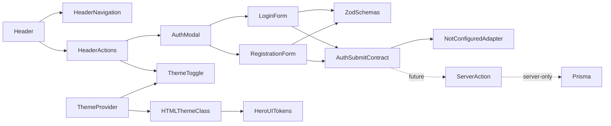
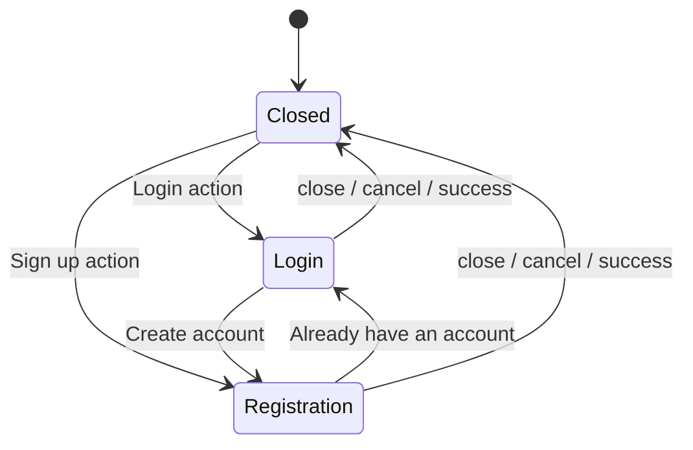

# Auth forms, modal, theme and Header refactor - Plan

## Goal Capsule

Перестроить клиентскую часть входа и регистрации: уменьшить `Header`, объединить auth-модалки, перевести формы на Zod, исправить отображение в светлой и тёмной темах и подготовить async-контракт для будущей серверной реализации через Prisma.

Работа выполняется поверх коммита `29f362d (auth v1)` в текущей ветке `auth-layout`. Новая ветка или worktree не создаются.

`ROADMAP.md` остаётся отдельным незакоммиченным файлом и не изменяется в рамках реализации.

---

## Product Contract

### Summary

Пользователь должен открывать Login и Sign up из одного набора desktop/mobile controls, переключаться между формами внутри одной модалки и получать доступные, хорошо видимые сообщения валидации.

До подключения backend формы валидируют данные, но не имитируют успешную авторизацию. Успешное закрытие модалки станет возможным через async submit-контракт после подключения server-only слоя.

### Requirements

- R1. Кнопки Login и Sign up на мобильном и десктопе открывают соответствующий режим одной controlled-модалки.
- R2. Открытие auth-модалки из мобильного меню одновременно закрывает меню.
- R3. Пользователь может переключаться между Login и Sign up внутри модалки без закрытия overlay.
- R4. При переключении режима или закрытии модалки значения, ошибки и submit-состояние предыдущей формы очищаются.
- R5. Zod является единственным источником клиентских правил валидации и прямой production-зависимостью проекта.
- R6. Ошибки поля появляются после blur; submit повторно валидирует всю форму и переводит фокус к первому невалидному полю.
- R7. Login проверяет валидный email и непустой пароль, не применяя к существующему паролю правила регистрации.
- R8. Registration требует валидный email, пароль минимум из восьми символов с заглавной буквой и цифрой, а также совпадающий `confirmPassword`.
- R9. Формы поддерживают pending, field errors и общий submit error; повторная отправка во время pending блокируется.
- R10. Модалка закрывается только после успешного async-результата.
- R11. До подключения backend обработчик возвращает понятное сообщение, что авторизация ещё не настроена, и оставляет форму открытой.
- R12. Theme toggle переключает light/dark, использует системную тему до первого явного выбора и сохраняет предпочтение пользователя.
- R13. Заголовки, поля, placeholder, descriptions, ошибки и кнопки читаемы в обеих темах и на мобильных экранах.
- R14. Будущие Server Actions повторно используют Zod-схемы, но Prisma Client и операции с базой остаются server-only.
- R15. Существующее поведение навигации, active link и логотипа сохраняется после декомпозиции `Header`.

### Acceptance Examples

- AE1. Пользователь открывает мобильное меню и нажимает Login: меню закрывается, поверх страницы появляется Login form.
- AE2. Пользователь вводит неправильный email и покидает поле: рядом с email появляется доступная ошибка.
- AE3. Пользователь исправляет email и повторно покидает поле: ошибка исчезает.
- AE4. Пользователь отправляет корректную форму до подключения backend: показывается общий not-configured error, модалка остаётся открытой.
- AE5. Пользователь переходит из Login в Sign up и обратно: overlay не закрывается, предыдущие значения и ошибки не сохраняются.
- AE6. Пользователь переключает тему и обновляет страницу: выбранная light/dark тема восстанавливается без вспышки противоположной темы.
- AE7. Будущий успешный submit handler возвращает success: только после этого модалка закрывается.

### Scope Boundaries

#### Included

- архитектура auth UI;
- Zod-схемы и типы данных;
- Login и Registration forms;
- единая auth-модалка;
- декомпозиция `Header`;
- mobile-first стили HeroUI v3;
- полноценный light/dark theme toggle;
- Vitest и React Testing Library;
- async-интерфейс будущего server-only auth-слоя.

#### Deferred to Follow-Up Work

- установка и конфигурация Prisma;
- выбор PostgreSQL или другого database provider;
- Prisma `User` model и миграции;
- Server Actions и auth service;
- хеширование и проверка паролей;
- session management и authorization;
- защищённые маршруты;
- password reset, social login и email verification;
- локализация auth-интерфейса.

---

## Planning Contract

### High-Level Technical Design



### Auth Modal State



Любой переход в `Closed` очищает внутреннее состояние формы. Переключение Login ↔ Registration сохраняет overlay, но remount формы сбрасывает её данные.

### Key Technical Decisions

- KTD1. Перенести auth-код в вертикальный модуль `src/features/auth`, удалив разрозненные корневые формы и отдельные modal wrappers.
- KTD2. Использовать один `AuthModal` с `AuthMode = "login" | "registration"`, а не две независимо смонтированные модалки.
- KTD3. Оставить `CustomModal` presentation-компонентом HeroUI, не содержащим auth state, Zod или Prisma.
- KTD4. Не добавлять React Hook Form. Для двух небольших форм использовать узкий auth-specific Zod adapter, управляющий touched/errors/pending.
- KTD5. Выводить `LoginValues` и `RegistrationValues` из Zod-схем, чтобы клиент и будущий Server Action не дублировали типы.
- KTD6. Представлять submit как async-операцию с явными success, form error и field errors.
- KTD7. До подключения backend использовать not-configured adapter; не закрывать модалку и не изображать успешный вход.
- KTD8. Подключить `next-themes` через класс `<html>` с системной темой по умолчанию и сохранением явного выбора.
- KTD9. Удалить частичное media-переопределение только `--background` и `--foreground`, которое смешивает тёмный контекст с оставшимися светлыми HeroUI overlay-токенами.
- KTD10. Использовать semantic tokens HeroUI v3 и локальную документацию вместо старых классов HeroUI v2.
- KTD11. Добавить Vitest, jsdom и React Testing Library как общую тестовую инфраструктуру проекта.

### Interface Changes

#### Auth types

- `AuthMode` принимает `"login"` или `"registration"`.
- `LoginValues` выводится из Login Zod schema.
- `RegistrationValues` выводится из Registration Zod schema.
- Submit result различает успешное завершение, общий form error и field errors, привязанные к именам полей.

#### Form contracts

Login и Registration forms принимают async submit handler, callback отмены и callback переключения auth mode.

Форма самостоятельно управляет touched, validation errors, pending и form error, но не решает, когда открывать или закрывать модалку.

#### AuthModal contract

`AuthModal` принимает текущий `AuthMode | null`, controlled open-change callback, callback смены режима и оба submit handler.

#### CustomModal contract

`CustomModal` продолжает принимать controlled open state, заголовок, содержимое и параметры размера. Auth-specific footer, формы и switching links остаются за пределами общего компонента.

### Output Structure

```text
src/
├── app/
│   └── providers.tsx
├── components/
│   ├── common/
│   │   └── CustomModal.tsx
│   └── UI/
│       └── Header/
│           ├── Header.tsx
│           ├── HeaderActions.tsx
│           ├── HeaderNavigation.tsx
│           └── Header.test.tsx
├── features/
│   ├── auth/
│   │   ├── model/
│   │   │   ├── auth.schemas.ts
│   │   │   ├── auth.schemas.test.ts
│   │   │   └── auth.types.ts
│   │   └── ui/
│   │       ├── AuthModal.tsx
│   │       ├── AuthModal.test.tsx
│   │       ├── LoginForm.tsx
│   │       ├── LoginForm.test.tsx
│   │       ├── RegistrationForm.tsx
│   │       ├── RegistrationForm.test.tsx
│   │       └── useAuthForm.ts
│   └── theme/
│       ├── ThemeToggle.tsx
│       └── ThemeToggle.test.tsx
└── test/
    └── setup.ts
```

---

## Implementation Units

### U1. Test infrastructure

**Goal:** создать базовую test environment до изменения поведения auth UI.

**Requirements:** R5, R12–R15.

**Dependencies:** отсутствуют.

**Files:** `package.json`, `vitest.config.mts`, `src/test/setup.ts`.

**Approach:**

- Добавить Vitest, jsdom, React Testing Library, DOM matchers, user-event, React Vite plugin и поддержку TypeScript path aliases.
- Добавить watch script для локальной разработки и однократный script для CI.
- Настроить общий cleanup.
- Добавлять browser API mocks только при фактической необходимости HeroUI primitives.

**Test scenarios:**

- Vitest запускает React component test в jsdom.
- Импорт через `@/*` разрешается.
- DOM matchers подключаются глобально.
- user-event может взаимодействовать с кнопкой и полем.
- Общий cleanup не переносит DOM между тестами.

**Verification:** новый test script завершается успешно, тестовая конфигурация не затрагивает production build.

### U2. Complete light/dark theme support

**Goal:** устранить конфликт theme tokens и добавить сохранённый переключатель темы.

**Requirements:** R12, R13.

**Dependencies:** U1.

**Files:** `src/app/providers.tsx`, `src/app/layout.tsx`, `src/app/globals.css`, `src/features/theme/ThemeToggle.tsx`, `src/features/theme/ThemeToggle.test.tsx`.

**Approach:**

- Добавить client provider вокруг содержимого `<body>`.
- Настроить `next-themes` на управление классом `<html>`, системную тему по умолчанию и сохранение выбора.
- Добавить `suppressHydrationWarning` только на `<html>`.
- До client mount показывать toggle нейтрального фиксированного размера.
- После mount отображать доступное действие для переключения текущей resolved theme.
- Удалить частичное `prefers-color-scheme` переопределение из `globals.css`.
- Оставить HeroUI ответственным за полный набор light/dark semantic tokens.

**Test scenarios:**

- Без сохранённого выбора применяется системная тема.
- Toggle меняет light на dark и dark на light.
- Выбор сохраняется и восстанавливается после remount.
- Кнопка имеет корректное доступное имя.
- До mount не рендерится неправильное theme-dependent состояние.
- Переключение не удаляет font classes с `<html>`.

**Verification:** нет hydration warning и вспышки противоположной темы; HeroUI modal, input и button используют согласованный набор theme tokens.

### U3. Auth schemas and contracts

**Goal:** централизовать правила валидации и подготовить переиспользуемый клиентско-серверный контракт.

**Requirements:** R5–R8, R14.

**Dependencies:** U1.

**Files:** `src/features/auth/model/auth.schemas.ts`, `src/features/auth/model/auth.types.ts`, `src/features/auth/model/auth.schemas.test.ts`, `package.json`.

**Approach:**

- Добавить Zod 4 как прямую dependency.
- Создать независимые Login и Registration schemas.
- Использовать Zod cross-field validation с error path `confirmPassword`.
- Выводить TypeScript types из схем.
- Добавить преобразование Zod issues в field error map.
- Не импортировать React, HeroUI, `next-themes`, Prisma или client-only код.

**Test scenarios:**

- Корректные login и registration payload успешно разбираются.
- Пустой и невалидный email возвращает ошибку `email`.
- Login отклоняет пустой пароль, но принимает непустой пароль, не соответствующий registration policy.
- Registration отдельно отклоняет короткий пароль, отсутствие заглавной буквы и отсутствие цифры.
- Несовпадающие пароли возвращают ошибку только для `confirmPassword`.
- Отсутствующее подтверждение пароля не проходит проверку.
- Ошибки преобразуются в HeroUI-compatible field map без потери сообщений.

**Verification:** все правила покрыты unit tests; client и будущий server-only слой могут импортировать одни и те же схемы.

### U4. Refactor Login and Registration forms

**Goal:** заменить полурабочую ручную валидацию предсказуемым Zod-driven поведением.

**Requirements:** R4–R11, R13.

**Dependencies:** U3.

**Files:** `src/features/auth/ui/useAuthForm.ts`, `src/features/auth/ui/LoginForm.tsx`, `src/features/auth/ui/LoginForm.test.tsx`, `src/features/auth/ui/RegistrationForm.tsx`, `src/features/auth/ui/RegistrationForm.test.tsx`.

**Approach:**

- Удалить неиспользуемые `formData` states и ручные regex validators.
- Исправить имена полей на `email`, `password`, `confirmPassword`.
- Узкий `useAuthForm` управляет touched fields, Zod errors, form error и pending.
- Проверять отдельное поле после blur, учитывая зависимость `confirmPassword` от `password`.
- На submit проверять всю форму и передавать handler только parsed Zod data.
- На pending блокировать повторную отправку и показывать HeroUI loading state.
- Cancel и close остаются доступными.
- Общий submit error выводить отдельно от `FieldError`.
- Использовать HeroUI `TextField`, `Label`, `Input`, `Description` и `FieldError` с корректным invalid state.
- Удалить `bg-default-100`, `text-background` и прочие несогласованные классы.
- На мобильном кнопки занимают ширину формы и располагаются вертикально; на широком экране переходят в строку.

**Test scenarios:**

- При первом render ошибки отсутствуют.
- Blur невалидного email показывает email error; исправление и повторный blur удаляют его.
- Login password проверяется только на непустое значение.
- Registration password показывает каждое нарушенное правило.
- Несовпадение паролей отображается у Confirm Password.
- Изменение password повторно делает ранее совпадающий confirmPassword невалидным.
- Submit пустой формы показывает все применимые ошибки и не вызывает handler.
- Валидный submit передаёт handler parsed values.
- Pending предотвращает двойной submit.
- Not-configured result показывает общий error и оставляет форму открытой.
- Success result вызывает callback успешного завершения.
- Field errors из async result объединяются с клиентским отображением без потери доступности.

**Verification:** в формах нет дублирующих validation rules, ESLint не сообщает unused-state warnings, ошибки связаны с полями через ARIA.

### U5. Consolidate auth modal flow

**Goal:** заменить две модалки единым управляемым auth flow.

**Requirements:** R1–R4, R9–R11, R13.

**Dependencies:** U4.

**Files:** `src/features/auth/ui/AuthModal.tsx`, `src/features/auth/ui/AuthModal.test.tsx`, `src/components/common/CustomModal.tsx`, `src/components/UI/modals/login.modal.tsx`, `src/components/UI/modals/registration.modal.tsx`.

**Approach:**

- Создать один `AuthModal`, выбирающий форму и title по `AuthMode`.
- Добавить переходы “Create account” и “Already have an account?”.
- Переключение режима не закрывает overlay и remount формы очищает её состояние.
- CloseTrigger, Escape, backdrop и Cancel проходят через единый controlled callback.
- `CustomModal` отвечает только за HeroUI modal anatomy и accessible heading.
- Использовать mobile-first ширину, прокрутку и desktop max-width из актуальных HeroUI v3 patterns.
- После перевода импортов удалить отдельные Login/Registration modal wrappers.

**Test scenarios:**

- Каждый режим показывает правильный заголовок, поля и submit label.
- Переход между режимами не закрывает dialog.
- После возврата предыдущая форма не содержит старых значений и ошибок.
- Pending и form error не переносятся между режимами.
- Cancel, Escape и backdrop вызывают controlled close.
- После закрытия состояние auth mode становится `null`.
- Фокус удерживается внутри dialog и возвращается trigger после закрытия.
- В DOM одновременно существует не более одного auth dialog.

**Verification:** старые modal wrappers больше не импортируются, `CustomModal` не содержит auth-specific условий.

### U6. Decompose Header and integrate auth/theme controls

**Goal:** превратить `Header` в компактный orchestration-компонент без дублирования UI и auth-логики.

**Requirements:** R1–R3, R12, R15.

**Dependencies:** U2, U5.

**Files:** `src/components/UI/Header/Header.tsx`, `src/components/UI/Header/HeaderNavigation.tsx`, `src/components/UI/Header/HeaderActions.tsx`, `src/components/UI/Header/Header.test.tsx`, `src/forms/login.form.tsx`, `src/forms/registration.form.tsx`.

**Approach:**

- Оставить в `Header` состояния мобильного меню и `AuthMode | null`.
- Вынести mapping навигации и active-route styling в `HeaderNavigation`.
- Вынести Login, Sign up и Theme toggle в `HeaderActions`.
- Desktop и mobile layouts используют один и тот же actions-компонент с вариантами расположения.
- Открытие auth mode проходит через общий callback, который предварительно закрывает mobile menu.
- Сохранить текущие logo, navigation links и active-link transition.
- После обновления всех импортов удалить старые корневые формы.

**Test scenarios:**

- Desktop и mobile Login/Sign up открывают правильные режимы.
- Mobile auth action предварительно закрывает меню.
- Быстрое переключение triggers не создаёт две модалки.
- Theme toggle доступен в требуемом Header layout.
- Menu toggle и Theme toggle имеют разные accessible names.
- Active navigation state и существующий public logo сохраняются.

**Verification:** `Header.tsx` содержит только композицию и минимальную координацию состояния; дублированная разметка auth-кнопок отсутствует; старые формы и модалки удалены после переноса.

---

## Verification Contract

### Automated Gates

- Новый CI test script проходит полностью.
- ESLint проходит без errors и без текущих unused-state warnings.
- TypeScript no-emit проходит.
- Prettier check проходит.
- Production build завершается успешно.

### Browser QA

Проверить при ширинах около 375 px, tablet breakpoint и desktop:

- открытие Login и Sign up;
- закрытие мобильного меню при auth action;
- переключение Login ↔ Registration;
- Cancel, CloseTrigger, Escape и backdrop;
- blur-validation и повторный blur после исправления;
- полный submit невалидной формы;
- pending и защита от двойной отправки;
- not-configured submit error;
- сохранение light/dark темы после refresh;
- читаемость modal heading, labels, input text, placeholders, descriptions и errors;
- tab order, focus trap, focus return и focus-visible;
- отсутствие горизонтального overflow и layout shift.

---

## Risks and Mitigations

- HeroUI Modal использует portal и browser APIs: test setup добавляет только необходимые jsdom mocks, а focus trap подтверждается browser QA.
- `next-themes` меняет `<html>` до hydration: `suppressHydrationWarning` ограничивается корневым элементом, theme-dependent icon появляется только после mount.
- Частичное ручное управление цветами может снова нарушить HeroUI tokens: auth UI использует semantic tokens, а глобальная тема управляется одним механизмом.
- Client-side Zod не является security boundary: будущий Server Action обязан повторно выполнить schema validation до Prisma.
- Текущий этап не может проверить реальный успешный login: success path покрывается внедрённым test handler, production fallback остаётся not configured.
- `ROADMAP.md` не входит в текущий коммит и не должен попасть в auth-refactor diff случайно.

---

## Definition of Done

- Реализация находится в ветке `auth-layout` поверх `29f362d`.
- `Header.tsx` является компактным orchestration-компонентом.
- В DOM присутствует только одна auth-модалка.
- Desktop и mobile auth actions используют единый state flow.
- Все правила форм определены в Zod и покрыты unit tests.
- Registration использует отдельный `confirmPassword`.
- Ошибки показываются после blur и корректно обновляются.
- Async submit поддерживает pending, form error, field errors и success.
- До подключения backend интерфейс не имитирует успешную авторизацию.
- Light/dark theme полностью переключает HeroUI tokens без невидимого текста и hydration warnings.
- Prisma отсутствует в client bundle и остаётся deferred server-only интеграцией.
- Старые modal/form файлы удалены после переноса.
- `ROADMAP.md` не изменён.
- Все автоматические и ручные проверки из Verification Contract пройдены.
- В diff не осталось мёртвого кода или файлов от промежуточных вариантов архитектуры.
